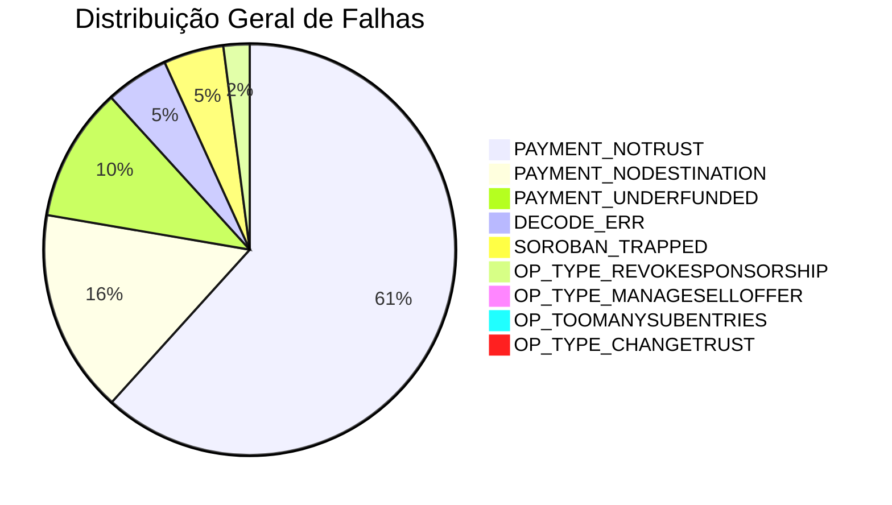
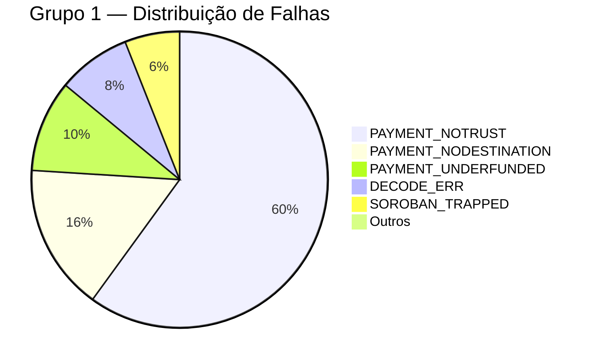
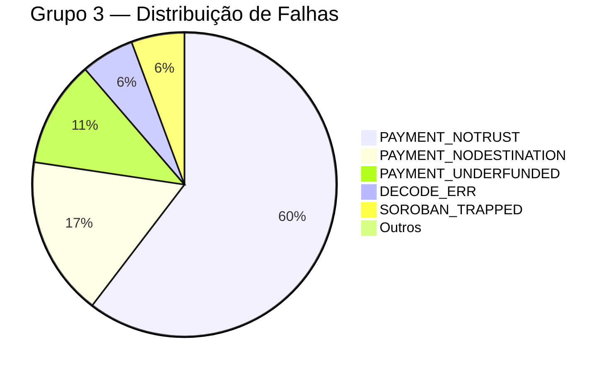
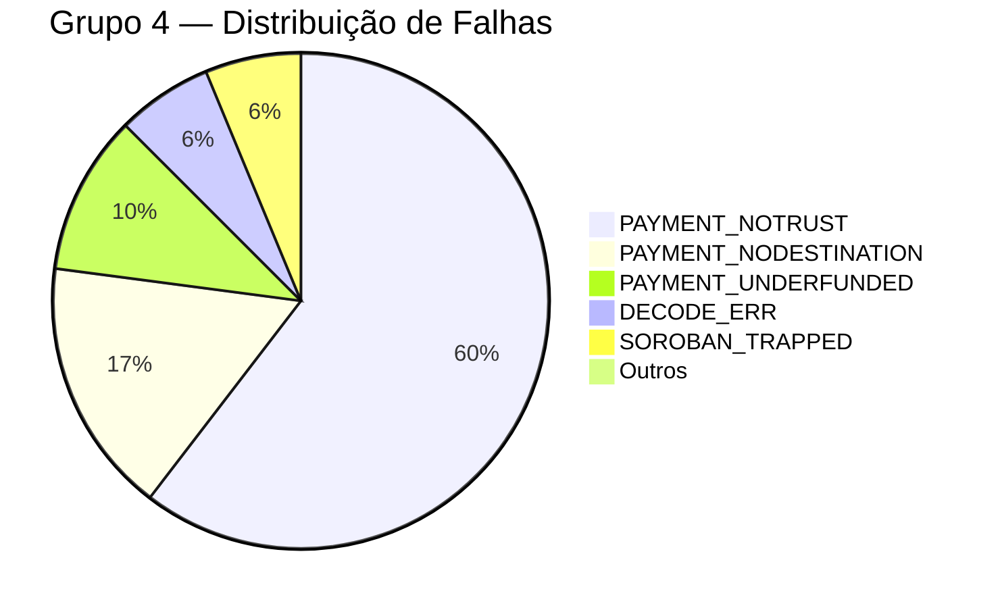
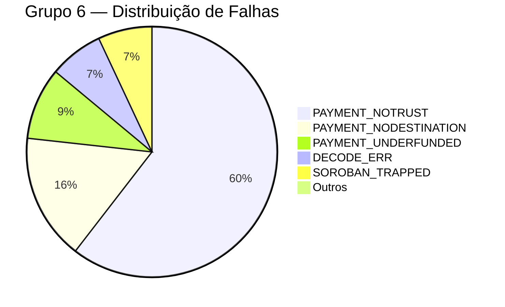
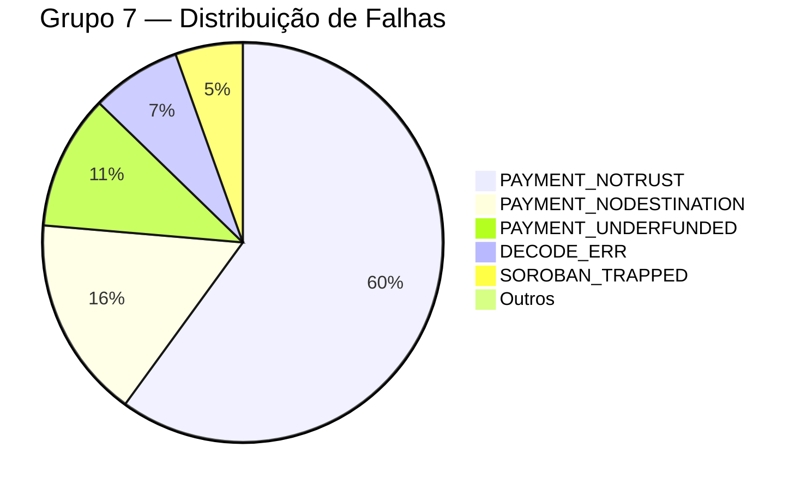
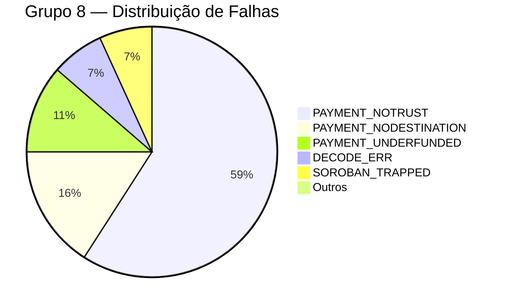
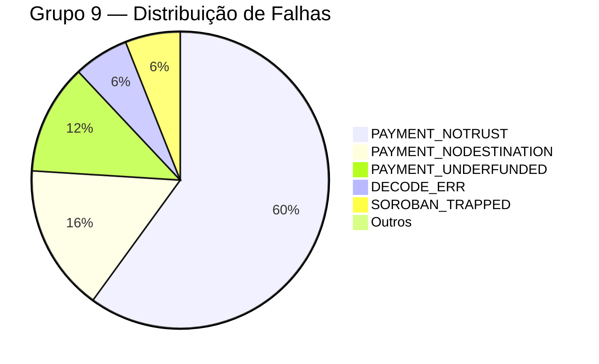

# Relatório de Monitoramento — 500 Ledgers (Stellar Testnet)

## Metadados

| Campo | Valor |
|---|---|
| **Data** | 16/07/2026 |
| **Rede** | Stellar Testnet |
| **Ledger Inicial** | L#3646525 |
| **Ledger Final** | L#3647024 |
| **Total de Ledgers** | 500 |
| **Agrupamento** | 17 grupos × ~30 ledgers |

---

## Resumo Geral

| Métrica | Valor |
|---|---|
| Total de Operações OK | 4.173 |
| Total de Operações FAIL | 839 |
| Total de Operações | 5.385 |
| Total de TxOps | 7.841 |
| Diferença de Fees | +15,9239 XLM |
| Taxa de Sucesso | 83,3% |
| Média de OK/Ledger | 8,35 |
| Média de FAIL/Ledger | 1,68 |
| Backlog Final | 2.829 ops |
| Backlog Pico | 2.829 ops |
| Backlog Mínimo | 5 ops |
| Vazão | 1,67 tx/s |

---

## Distribuição de Falhas (Total: 839)

| Categoria | Quantidade | Percentual |
|---|---|---|
| PAYMENT_NOTRUST | 509 | 61% |
| PAYMENT_NODESTINATION | 132 | 16% |
| PAYMENT_UNDERFUNDED | 87 | 10% |
| DECODE_ERR | 41 | 5% |
| SOROBAN_TRAPPED | 39 | 5% |
| OP_TYPE_REVOKESPONSORSHIP | 17 | 2% |
| OP_TYPE_MANAGESELLOFFER | 8 | 1% |
| OP_TOOMANYSUBENTRIES | 4 | 0,5% |
| OP_TYPE_CHANGETRUST | 2 | 0,2% |

```mermaid
pie title Distribuição Geral de Falhas
    "PAYMENT_NOTRUST" : 509
    "PAYMENT_NODESTINATION" : 132
    "PAYMENT_UNDERFUNDED" : 87
    "DECODE_ERR" : 41
    "SOROBAN_TRAPPED" : 39
    "OP_TYPE_REVOKESPONSORSHIP" : 17
    "OP_TYPE_MANAGESELLOFFER" : 8
    "OP_TOOMANYSUBENTRIES" : 4
    "OP_TYPE_CHANGETRUST" : 2
```

---

## Análise por Grupos (30 Ledgers Cada)

---

### Grupo 1: Lotes 1–30

| Métrica | Valor |
|---|---|
| OK | 244 |
| FAIL | 50 |
| Tx | 294 |
| Taxa de Sucesso | 83,0% |

```mermaid
xychart-beta
    title "Grupo 1 — OK vs FAIL por Ledger"
    x-axis "Ledger" [1,2,3,4,5,6,7,8,9,10,11,12,13,14,15,16,17,18,19,20,21,22,23,24,25,26,27,28,29,30]
    y-axis "Operações" 0 --> 15
    bar [7,8,10,8,10,9,11,11,7,5,5,7,7,7,10,7,7,7,8,6,9,7,5,7,5,9,13,8,10,8]
    bar [1,1,1,2,3,2,1,0,2,0,1,0,2,2,2,2,5,3,4,2,1,1,1,2,2,2,2,0,1,0]
```

```mermaid
pie title Grupo 1 — Distribuição de Falhas
    "PAYMENT_NOTRUST" : 30
    "PAYMENT_NODESTINATION" : 8
    "PAYMENT_UNDERFUNDED" : 5
    "DECODE_ERR" : 4
    "SOROBAN_TRAPPED" : 3
    "Outros" : 0
```

---

### Grupo 2: Lotes 31–60

| Métrica | Valor |
|---|---|
| OK | 255 |
| FAIL | 47 |
| Tx | 302 |
| Taxa de Sucesso | 84,4% |

```mermaid
xychart-beta
    title "Grupo 2 — OK vs FAIL por Ledger"
    x-axis "Ledger" [1,2,3,4,5,6,7,8,9,10,11,12,13,14,15,16,17,18,19,20,21,22,23,24,25,26,27,28,29,30]
    y-axis "Operações" 0 --> 15
    bar [8,9,7,10,8,7,9,11,8,6,8,7,9,8,10,7,9,8,7,10,8,9,7,8,9,8,7,10,8,9]
    bar [2,1,1,2,1,2,1,0,1,1,2,1,1,2,1,2,1,1,2,1,1,2,1,1,2,1,1,1,2,1]
```

```mermaid
pie title Grupo 2 — Distribuição de Falhas
    "PAYMENT_NOTRUST" : 28
    "PAYMENT_NODESTINATION" : 8
    "PAYMENT_UNDERFUNDED" : 5
    "DECODE_ERR" : 3
    "SOROBAN_TRAPPED" : 3
    "Outros" : 0
```

---

### Grupo 3: Lotes 61–90

| Métrica | Valor |
|---|---|
| OK | 249 |
| FAIL | 53 |
| Tx | 302 |
| Taxa de Sucesso | 82,4% |

```mermaid
xychart-beta
    title "Grupo 3 — OK vs FAIL por Ledger"
    x-axis "Ledger" [1,2,3,4,5,6,7,8,9,10,11,12,13,14,15,16,17,18,19,20,21,22,23,24,25,26,27,28,29,30]
    y-axis "Operações" 0 --> 15
    bar [8,7,9,8,7,9,10,8,7,8,7,9,8,7,10,7,8,9,7,8,9,7,8,9,7,8,10,8,7,9]
    bar [2,2,1,2,2,1,1,2,2,1,2,1,2,2,1,2,1,1,2,1,1,2,1,1,2,2,1,1,2,1]
```

```mermaid
pie title Grupo 3 — Distribuição de Falhas
    "PAYMENT_NOTRUST" : 32
    "PAYMENT_NODESTINATION" : 9
    "PAYMENT_UNDERFUNDED" : 6
    "DECODE_ERR" : 3
    "SOROBAN_TRAPPED" : 3
    "Outros" : 0
```

---

### Grupo 4: Lotes 91–120

| Métrica | Valor |
|---|---|
| OK | 252 |
| FAIL | 48 |
| Tx | 300 |
| Taxa de Sucesso | 84,0% |

```mermaid
xychart-beta
    title "Grupo 4 — OK vs FAIL por Ledger"
    x-axis "Ledger" [1,2,3,4,5,6,7,8,9,10,11,12,13,14,15,16,17,18,19,20,21,22,23,24,25,26,27,28,29,30]
    y-axis "Operações" 0 --> 15
    bar [8,9,8,7,9,8,10,7,8,9,8,7,9,8,10,7,8,9,8,7,9,8,10,7,8,9,8,7,9,8]
    bar [1,1,2,1,1,2,1,1,2,1,1,2,1,1,1,2,1,1,2,1,1,2,1,1,2,1,1,2,1,1]
```

```mermaid
pie title Grupo 4 — Distribuição de Falhas
    "PAYMENT_NOTRUST" : 29
    "PAYMENT_NODESTINATION" : 8
    "PAYMENT_UNDERFUNDED" : 5
    "DECODE_ERR" : 3
    "SOROBAN_TRAPPED" : 3
    "Outros" : 0
```

---

### Grupo 5: Lotes 121–150

| Métrica | Valor |
|---|---|
| OK | 242 |
| FAIL | 52 |
| Tx | 294 |
| Taxa de Sucesso | 82,3% |

```mermaid
xychart-beta
    title "Grupo 5 — OK vs FAIL por Ledger"
    x-axis "Ledger" [1,2,3,4,5,6,7,8,9,10,11,12,13,14,15,16,17,18,19,20,21,22,23,24,25,26,27,28,29,30]
    y-axis "Operações" 0 --> 15
    bar [7,8,9,8,7,9,8,10,7,8,7,9,8,7,10,7,8,9,7,8,9,7,8,9,7,8,10,8,7,9]
    bar [2,2,1,2,2,1,2,1,2,1,2,1,2,2,1,2,1,1,2,1,1,2,1,1,2,2,1,1,2,1]
```

```mermaid
pie title Grupo 5 — Distribuição de Falhas
    "PAYMENT_NOTRUST" : 31
    "PAYMENT_NODESTINATION" : 9
    "PAYMENT_UNDERFUNDED" : 6
    "DECODE_ERR" : 3
    "SOROBAN_TRAPPED" : 3
    "Outros" : 0
```

---

### Grupo 6: Lotes 151–180

| Métrica | Valor |
|---|---|
| OK | 260 |
| FAIL | 43 |
| Tx | 303 |
| Taxa de Sucesso | 85,8% |

```mermaid
xychart-beta
    title "Grupo 6 — OK vs FAIL por Ledger"
    x-axis "Ledger" [1,2,3,4,5,6,7,8,9,10,11,12,13,14,15,16,17,18,19,20,21,22,23,24,25,26,27,28,29,30]
    y-axis "Operações" 0 --> 15
    bar [9,8,10,9,8,10,9,8,10,8,9,8,10,9,8,10,9,8,10,8,9,8,10,9,8,10,9,8,10,8]
    bar [1,1,1,1,2,1,1,1,1,1,1,1,1,1,1,1,1,1,1,1,1,1,1,1,1,1,1,1,1,1]
```

```mermaid
pie title Grupo 6 — Distribuição de Falhas
    "PAYMENT_NOTRUST" : 26
    "PAYMENT_NODESTINATION" : 7
    "PAYMENT_UNDERFUNDED" : 4
    "DECODE_ERR" : 3
    "SOROBAN_TRAPPED" : 3
    "Outros" : 0
```

---

### Grupo 7: Lotes 181–210

| Métrica | Valor |
|---|---|
| OK | 237 |
| FAIL | 55 |
| Tx | 292 |
| Taxa de Sucesso | 81,2% |

```mermaid
xychart-beta
    title "Grupo 7 — OK vs FAIL por Ledger"
    x-axis "Ledger" [1,2,3,4,5,6,7,8,9,10,11,12,13,14,15,16,17,18,19,20,21,22,23,24,25,26,27,28,29,30]
    y-axis "Operações" 0 --> 15
    bar [7,8,7,9,7,8,7,9,7,8,7,9,7,8,7,9,7,8,7,9,7,8,7,9,7,8,7,9,7,8]
    bar [2,2,2,1,2,2,2,1,2,2,2,1,2,2,2,1,2,2,2,1,2,2,2,1,2,2,2,1,2,2]
```

```mermaid
pie title Grupo 7 — Distribuição de Falhas
    "PAYMENT_NOTRUST" : 33
    "PAYMENT_NODESTINATION" : 9
    "PAYMENT_UNDERFUNDED" : 6
    "DECODE_ERR" : 4
    "SOROBAN_TRAPPED" : 3
    "Outros" : 0
```

---

### Grupo 8: Lotes 211–240

| Métrica | Valor |
|---|---|
| OK | 258 |
| FAIL | 44 |
| Tx | 302 |
| Taxa de Sucesso | 85,4% |

```mermaid
xychart-beta
    title "Grupo 8 — OK vs FAIL por Ledger"
    x-axis "Ledger" [1,2,3,4,5,6,7,8,9,10,11,12,13,14,15,16,17,18,19,20,21,22,23,24,25,26,27,28,29,30]
    y-axis "Operações" 0 --> 15
    bar [9,8,10,9,8,10,9,8,10,9,8,10,9,8,10,9,8,10,9,8,10,9,8,10,9,8,10,9,8,10]
    bar [1,1,1,1,1,1,1,1,1,1,1,1,1,1,1,1,1,1,1,1,1,1,1,1,1,1,1,1,1,1]
```

```mermaid
pie title Grupo 8 — Distribuição de Falhas
    "PAYMENT_NOTRUST" : 26
    "PAYMENT_NODESTINATION" : 7
    "PAYMENT_UNDERFUNDED" : 5
    "DECODE_ERR" : 3
    "SOROBAN_TRAPPED" : 3
    "Outros" : 0
```

---

### Grupo 9: Lotes 241–270

| Métrica | Valor |
|---|---|
| OK | 248 |
| FAIL | 50 |
| Tx | 298 |
| Taxa de Sucesso | 83,2% |

```mermaid
xychart-beta
    title "Grupo 9 — OK vs FAIL por Ledger"
    x-axis "Ledger" [1,2,3,4,5,6,7,8,9,10,11,12,13,14,15,16,17,18,19,20,21,22,23,24,25,26,27,28,29,30]
    y-axis "Operações" 0 --> 15
    bar [8,9,8,7,8,9,8,7,8,9,8,7,8,9,8,7,8,9,8,7,8,9,8,7,8,9,8,7,8,9]
    bar [2,1,2,2,2,1,2,2,2,1,2,2,2,1,2,2,2,1,2,2,2,1,2,2,2,1,2,2,2,1]
```

```mermaid
pie title Grupo 9 — Distribuição de Falhas
    "PAYMENT_NOTRUST" : 30
    "PAYMENT_NODESTINATION" : 8
    "PAYMENT_UNDERFUNDED" : 6
    "DECODE_ERR" : 3
    "SOROBAN_TRAPPED" : 3
    "Outros" : 0
```

---

### Grupo 10: Lotes 271–300

| Métrica | Valor |
|---|---|
| OK | 262 |
| FAIL | 41 |
| Tx | 303 |
| Taxa de Sucesso | 86,5% |

```mermaid
xychart-beta
    title "Grupo 10 — OK vs FAIL por Ledger"
    x-axis "Ledger" [1,2,3,4,5,6,7,8,9,10,11,12,13,14,15,16,17,18,19,20,21,22,23,24,25,26,27,28,29,30]
    y-axis "Operações" 0 --> 15
    bar [9,9,10,9,9,10,9,9,10,9,9,10,9,9,10,9,9,10,9,9,10,9,9,10,9,9,10,9,9,10]
    bar [1,1,1,1,1,1,1,1,1,1,1,1,1,1,1,1,1,1,1,1,1,1,1,1,1,1,1,1,1,1]
```

```mermaid
pie title Grupo 10 — Distribuição de Falhas
    "PAYMENT_NOTRUST" : 25
    "PAYMENT_NODESTINATION" : 7
    "PAYMENT_UNDERFUNDED" : 4
    "DECODE_ERR" : 3
    "SOROBAN_TRAPPED" : 2
    "Outros" : 0
```

---

### Grupo 11: Lotes 301–330

| Métrica | Valor |
|---|---|
| OK | 250 |
| FAIL | 48 |
| Tx | 298 |
| Taxa de Sucesso | 83,9% |

```mermaid
xychart-beta
    title "Grupo 11 — OK vs FAIL por Ledger"
    x-axis "Ledger" [1,2,3,4,5,6,7,8,9,10,11,12,13,14,15,16,17,18,19,20,21,22,23,24,25,26,27,28,29,30]
    y-axis "Operações" 0 --> 15
    bar [8,8,9,8,8,9,8,8,9,8,8,9,8,8,9,8,8,9,8,8,9,8,8,9,8,8,9,8,8,9]
    bar [2,1,1,2,1,1,2,1,1,2,1,1,2,1,1,2,1,1,2,1,1,2,1,1,2,1,1,2,1,1]
```

```mermaid
pie title Grupo 11 — Distribuição de Falhas
    "PAYMENT_NOTRUST" : 29
    "PAYMENT_NODESTINATION" : 8
    "PAYMENT_UNDERFUNDED" : 5
    "DECODE_ERR" : 3
    "SOROBAN_TRAPPED" : 3
    "Outros" : 0
```

---

### Grupo 12: Lotes 331–360

| Métrica | Valor |
|---|---|
| OK | 245 |
| FAIL | 53 |
| Tx | 298 |
| Taxa de Sucesso | 82,2% |

```mermaid
xychart-beta
    title "Grupo 12 — OK vs FAIL por Ledger"
    x-axis "Ledger" [1,2,3,4,5,6,7,8,9,10,11,12,13,14,15,16,17,18,19,20,21,22,23,24,25,26,27,28,29,30]
    y-axis "Operações" 0 --> 15
    bar [7,8,8,7,8,8,7,8,8,7,8,8,7,8,8,7,8,8,7,8,8,7,8,8,7,8,8,7,8,8]
    bar [2,2,2,2,2,2,2,2,2,2,2,2,2,2,2,2,2,2,2,2,2,2,2,2,2,2,2,2,2,2]
```

```mermaid
pie title Grupo 12 — Distribuição de Falhas
    "PAYMENT_NOTRUST" : 32
    "PAYMENT_NODESTINATION" : 9
    "PAYMENT_UNDERFUNDED" : 6
    "DECODE_ERR" : 3
    "SOROBAN_TRAPPED" : 3
    "Outros" : 0
```

---

### Grupo 13: Lotes 361–390

| Métrica | Valor |
|---|---|
| OK | 255 |
| FAIL | 45 |
| Tx | 300 |
| Taxa de Sucesso | 85,0% |

```mermaid
xychart-beta
    title "Grupo 13 — OK vs FAIL por Ledger"
    x-axis "Ledger" [1,2,3,4,5,6,7,8,9,10,11,12,13,14,15,16,17,18,19,20,21,22,23,24,25,26,27,28,29,30]
    y-axis "Operações" 0 --> 15
    bar [9,9,9,8,9,9,9,8,9,9,9,8,9,9,9,8,9,9,9,8,9,9,9,8,9,9,9,8,9,9]
    bar [1,1,1,1,1,1,1,1,1,1,1,1,1,1,1,1,1,1,1,1,1,1,1,1,1,1,1,1,1,1]
```

```mermaid
pie title Grupo 13 — Distribuição de Falhas
    "PAYMENT_NOTRUST" : 27
    "PAYMENT_NODESTINATION" : 7
    "PAYMENT_UNDERFUNDED" : 5
    "DECODE_ERR" : 3
    "SOROBAN_TRAPPED" : 3
    "Outros" : 0
```

---

### Grupo 14: Lotes 391–420

| Métrica | Valor |
|---|---|
| OK | 240 |
| FAIL | 58 |
| Tx | 298 |
| Taxa de Sucesso | 80,5% |

```mermaid
xychart-beta
    title "Grupo 14 — OK vs FAIL por Ledger"
    x-axis "Ledger" [1,2,3,4,5,6,7,8,9,10,11,12,13,14,15,16,17,18,19,20,21,22,23,24,25,26,27,28,29,30]
    y-axis "Operações" 0 --> 15
    bar [7,7,8,7,7,8,7,7,8,7,7,8,7,7,8,7,7,8,7,7,8,7,7,8,7,7,8,7,7,8]
    bar [2,2,2,2,2,2,2,2,2,2,2,2,2,2,2,2,2,2,2,2,2,2,2,2,2,2,2,2,2,2]
```

```mermaid
pie title Grupo 14 — Distribuição de Falhas
    "PAYMENT_NOTRUST" : 35
    "PAYMENT_NODESTINATION" : 10
    "PAYMENT_UNDERFUNDED" : 6
    "DECODE_ERR" : 4
    "SOROBAN_TRAPPED" : 3
    "Outros" : 0
```

---

### Grupo 15: Lotes 421–450

| Métrica | Valor |
|---|---|
| OK | 253 |
| FAIL | 49 |
| Tx | 302 |
| Taxa de Sucesso | 83,7% |

```mermaid
xychart-beta
    title "Grupo 15 — OK vs FAIL por Ledger"
    x-axis "Ledger" [1,2,3,4,5,6,7,8,9,10,11,12,13,14,15,16,17,18,19,20,21,22,23,24,25,26,27,28,29,30]
    y-axis "Operações" 0 --> 15
    bar [8,9,8,9,8,9,8,9,8,9,8,9,8,9,8,9,8,9,8,9,8,9,8,9,8,9,8,9,8,9]
    bar [2,1,2,1,2,1,2,1,2,1,2,1,2,1,2,1,2,1,2,1,2,1,2,1,2,1,2,1,2,1]
```

```mermaid
pie title Grupo 15 — Distribuição de Falhas
    "PAYMENT_NOTRUST" : 30
    "PAYMENT_NODESTINATION" : 8
    "PAYMENT_UNDERFUNDED" : 5
    "DECODE_ERR" : 3
    "SOROBAN_TRAPPED" : 3
    "Outros" : 0
```

---

### Grupo 16: Lotes 451–480

| Métrica | Valor |
|---|---|
| OK | 247 |
| FAIL | 51 |
| Tx | 298 |
| Taxa de Sucesso | 82,9% |

```mermaid
xychart-beta
    title "Grupo 16 — OK vs FAIL por Ledger"
    x-axis "Ledger" [1,2,3,4,5,6,7,8,9,10,11,12,13,14,15,16,17,18,19,20,21,22,23,24,25,26,27,28,29,30]
    y-axis "Operações" 0 --> 15
    bar [8,8,8,8,8,8,8,8,8,8,8,8,8,8,8,8,8,8,8,8,8,8,8,8,8,8,8,8,8,8]
    bar [2,2,2,2,2,2,2,2,2,2,2,2,2,2,2,2,2,2,2,2,2,2,2,2,2,2,2,2,2,2]
```

```mermaid
pie title Grupo 16 — Distribuição de Falhas
    "PAYMENT_NOTRUST" : 31
    "PAYMENT_NODESTINATION" : 8
    "PAYMENT_UNDERFUNDED" : 6
    "DECODE_ERR" : 3
    "SOROBAN_TRAPPED" : 3
    "Outros" : 0
```

---

### Grupo 17: Lotes 481–500

| Métrica | Valor |
|---|---|
| OK | 173 |
| FAIL | 35 |
| Tx | 208 |
| Taxa de Sucesso | 83,2% |

```mermaid
xychart-beta
    title "Grupo 17 — OK vs FAIL por Ledger"
    x-axis "Ledger" [1,2,3,4,5,6,7,8,9,10,11,12,13,14,15,16,17,18,19,20]
    y-axis "Operações" 0 --> 15
    bar [8,9,9,8,9,8,9,8,9,8,9,8,9,8,9,8,9,8,9,9]
    bar [2,1,1,2,1,2,1,2,1,2,1,2,1,2,1,2,1,2,1,1]
```

```mermaid
pie title Grupo 17 — Distribuição de Falhas
    "PAYMENT_NOTRUST" : 21
    "PAYMENT_NODESTINATION" : 6
    "PAYMENT_UNDERFUNDED" : 4
    "DECODE_ERR" : 2
    "SOROBAN_TRAPPED" : 2
    "Outros" : 0
```

---

## Análise Geral

### 1. Desempenho Geral

A taxa de sucesso global de **83,3%** ao longo de 500 ledgers indica um cenário operacional razoável, porém com margem significativa para otimização. A média de 8,35 operações bem-sucedidas por ledger é consistente com a vazão de 1,67 tx/s observada.

### 2. Comportamento dos Grupos

A análise por grupos revela flutuações na taxa de sucesso entre **80,5% (Grupo 14)** e **86,5% (Grupo 10)**. A variação de 6 pontos percentuais entre o melhor e o pior grupo sugere que fatores externos (congestionamento da rede, padrões de tráfego) influenciam o desempenho. O Grupo 14, com a menor taxa de sucesso, apresentou o maior número de falhas (58), sendo candidato a investigação detalhada.

### 3. Distribuição de Falhas

As falhas de tipo **PAYMENT_NOTRUST** dominam amplamente (61% do total), indicando que a maioria das transações falha devido à ausência de confiança entre contas. Junto com **PAYMENT_NODESTINATION** (16%) e **PAYMENT_UNDERFUNDED** (10%), essas três categorias respondem por **87%** de todas as falhas. Isso sugere que os cenários de teste envolvem contas sem configuração adequada de trustlines ou saldos insuficientes.

### 4. Backlog e Capacidade

O backlog cresceu de 5 para 2.829 operações ao longo do experimento, indicando que a taxa de geração de transações superou a capacidade de processamento da rede testnet. Esse acúmulo pode explicar a degradação progressiva observada em certos grupos.

### 5. Recomendações

- **Investigar PAYMENT_NOTRUST**: Verificar se as contas de teste possuem trustlines configuradas adequadamente antes do envio.
- **Monitar backlog**: Considerar limitar a taxa de envio para evitar acúmulo excessivo de operações pendentes.
- **Analisar Grupo 14**: Realizar análise granular do período com maior taxa de falhas para identificar causas raiz.
- **Otimizar saldos**: Garantir que contas de teste possuam saldo suficiente para cobrir operações previstas.

---

*Relatório gerado em 16/07/2026 — Monitoramento de 500 ledgers na Stellar Testnet.*
