# Monitoring Report - Stellar Testnet Horizon

**Date:** July 16, 2026  
**Analysis Period:** 100 consecutive ledgers  
**Ledger Range:** L#3647282 to L#3647381  
**Monitored Service:** Stellar Testnet Horizon  

---

## 1. General Summary

| Metric | Value |
|---------|-------|
| Total Ledgers | 100 |
| Total OK Operations | 765 |
| Total FAIL Operations | 171 |
| Total Transactions | 960 |
| Total Operations in Transactions | 1,440 |
| Success Rate | 81.7% |
| Average OK per Ledger | 7.7 |
| Average FAIL per Ledger | 1.7 |
| Fee Pool Difference | +6.2009 XLM |

---

## 2. Analysis by Group (10 Ledgers Each)

---

### Group 1: L#3647282 to L#3647291

| Ledger | OK | FAIL | Total | Success Rate |
|--------|-----|------|-------|--------------|
| L#3647282 | 7 | 3 | 10 | 70.0% |
| L#3647283 | 9 | 2 | 11 | 81.8% |
| L#3647284 | 7 | 3 | 10 | 70.0% |
| L#3647285 | 10 | 1 | 11 | 90.9% |
| L#3647286 | 8 | 2 | 10 | 80.0% |
| L#3647287 | 9 | 1 | 10 | 90.0% |
| L#3647288 | 6 | 3 | 9 | 66.7% |
| L#3647289 | 7 | 2 | 9 | 77.8% |
| L#3647290 | 9 | 3 | 12 | 75.0% |
| L#3647291 | 8 | 3 | 11 | 72.7% |

```mermaid
xychart-beta
    title "OK vs FAIL Operations - Group 1 (L#3647282-L#3647291)"
    x-axis ["L282","L283","L284","L285","L286","L287","L288","L289","L290","L291"]
    y-axis "Operations" 0 --> 12
    bar [7,9,7,10,8,9,6,7,9,8]
    bar [3,2,3,1,2,1,3,2,3,3]
```

**Group 1 Summary:**
- Total OK: 80
- Total FAIL: 23
- Success Rate: 77.7%
- Fee Pool: 400,297.636 → 400,300.342 (+2.706 XLM)

---

### Group 2: L#3647292 to L#3647301

| Ledger | OK | FAIL | Total | Success Rate |
|--------|-----|------|-------|--------------|
| L#3647292 | 10 | 2 | 12 | 83.3% |
| L#3647293 | 8 | 2 | 10 | 80.0% |
| L#3647294 | 9 | 0 | 9 | 100.0% |
| L#3647295 | 6 | 2 | 8 | 75.0% |
| L#3647296 | 9 | 1 | 10 | 90.0% |
| L#3647297 | 11 | 1 | 12 | 91.7% |
| L#3647298 | 7 | 2 | 9 | 77.8% |
| L#3647299 | 7 | 1 | 8 | 87.5% |
| L#3647300 | 4 | 1 | 5 | 80.0% |
| L#3647301 | 2 | 1 | 3 | 66.7% |

```mermaid
xychart-beta
    title "OK vs FAIL Operations - Group 2 (L#3647292-L#3647301)"
    x-axis ["L292","L293","L294","L295","L296","L297","L298","L299","L300","L301"]
    y-axis "Operations" 0 --> 12
    bar [10,8,9,6,9,11,7,7,4,2]
    bar [2,2,0,2,1,1,2,1,1,1]
```

**Group 2 Summary:**
- Total OK: 65
- Total FAIL: 13
- Success Rate: 83.3%
- Fee Pool: 400,300.342 → 400,302.154 (+1.812 XLM)

---

### Group 3: L#3647302 to L#3647311

| Ledger | OK | FAIL | Total | Success Rate |
|--------|-----|------|-------|--------------|
| L#3647302 | 6 | 2 | 8 | 75.0% |
| L#3647303 | 7 | 2 | 9 | 77.8% |
| L#3647304 | 3 | 2 | 5 | 60.0% |
| L#3647305 | 8 | 3 | 11 | 72.7% |
| L#3647306 | 6 | 1 | 7 | 85.7% |
| L#3647307 | 6 | 1 | 7 | 85.7% |
| L#3647308 | 6 | 2 | 8 | 75.0% |
| L#3647309 | 11 | 2 | 13 | 84.6% |
| L#3647310 | 11 | 1 | 12 | 91.7% |
| L#3647311 | 8 | 1 | 9 | 88.9% |

```mermaid
xychart-beta
    title "OK vs FAIL Operations - Group 3 (L#3647302-L#3647311)"
    x-axis ["L302","L303","L304","L305","L306","L307","L308","L309","L310","L311"]
    y-axis "Operations" 0 --> 12
    bar [6,7,3,8,6,6,6,11,11,8]
    bar [2,2,2,3,1,1,2,2,1,1]
```

**Group 3 Summary:**
- Total OK: 72
- Total FAIL: 17
- Success Rate: 80.9%
- Fee Pool: 400,302.154 → 400,302.284 (+0.130 XLM)

---

### Group 4: L#3647312 to L#3647321

| Ledger | OK | FAIL | Total | Success Rate |
|--------|-----|------|-------|--------------|
| L#3647312 | 7 | 1 | 8 | 87.5% |
| L#3647313 | 9 | 1 | 10 | 90.0% |
| L#3647314 | 7 | 0 | 7 | 100.0% |
| L#3647315 | 9 | 2 | 11 | 81.8% |
| L#3647316 | 10 | 3 | 13 | 76.9% |
| L#3647317 | 9 | 2 | 11 | 81.8% |
| L#3647318 | 6 | 2 | 8 | 75.0% |
| L#3647319 | 7 | 1 | 8 | 87.5% |
| L#3647320 | 6 | 2 | 8 | 75.0% |
| L#3647321 | 6 | 1 | 7 | 85.7% |

```mermaid
xychart-beta
    title "OK vs FAIL Operations - Group 4 (L#3647312-L#3647321)"
    x-axis ["L312","L313","L314","L315","L316","L317","L318","L319","L320","L321"]
    y-axis "Operations" 0 --> 12
    bar [7,9,7,9,10,9,6,7,6,6]
    bar [1,1,0,2,3,2,2,1,2,1]
```

**Group 4 Summary:**
- Total OK: 76
- Total FAIL: 15
- Success Rate: 83.5%
- Fee Pool: 400,302.284 → 400,302.428 (+0.144 XLM)

---

### Group 5: L#3647322 to L#3647331

| Ledger | OK | FAIL | Total | Success Rate |
|--------|-----|------|-------|--------------|
| L#3647322 | 8 | 1 | 9 | 88.9% |
| L#3647323 | 9 | 2 | 11 | 81.8% |
| L#3647324 | 5 | 1 | 6 | 83.3% |
| L#3647325 | 6 | 0 | 6 | 100.0% |
| L#3647326 | 3 | 3 | 6 | 50.0% |
| L#3647327 | 6 | 2 | 8 | 75.0% |
| L#3647328 | 12 | 1 | 13 | 92.3% |
| L#3647329 | 11 | 2 | 13 | 84.6% |
| L#3647330 | 7 | 2 | 9 | 77.8% |
| L#3647331 | 8 | 1 | 9 | 88.9% |

```mermaid
xychart-beta
    title "OK vs FAIL Operations - Group 5 (L#3647322-L#3647331)"
    x-axis ["L322","L323","L324","L325","L326","L327","L328","L329","L330","L331"]
    y-axis "Operations" 0 --> 12
    bar [8,9,5,6,3,6,12,11,7,8]
    bar [1,2,1,0,3,2,1,2,2,1]
```

**Group 5 Summary:**
- Total OK: 75
- Total FAIL: 15
- Success Rate: 83.3%
- Fee Pool: 400,302.428 → 400,302.528 (+0.100 XLM)

---

### Group 6: L#3647332 to L#3647341

| Ledger | OK | FAIL | Total | Success Rate |
|--------|-----|------|-------|--------------|
| L#3647332 | 14 | 3 | 17 | 82.4% |
| L#3647333 | 9 | 2 | 11 | 81.8% |
| L#3647334 | 9 | 1 | 10 | 90.0% |
| L#3647335 | 11 | 1 | 12 | 91.7% |
| L#3647336 | 7 | 0 | 7 | 100.0% |
| L#3647337 | 11 | 1 | 12 | 91.7% |
| L#3647338 | 7 | 0 | 7 | 100.0% |
| L#3647339 | 8 | 1 | 9 | 88.9% |
| L#3647340 | 9 | 3 | 12 | 75.0% |
| L#3647341 | 7 | 2 | 9 | 77.8% |

```mermaid
xychart-beta
    title "OK vs FAIL Operations - Group 6 (L#3647332-L#3647341)"
    x-axis ["L332","L333","L334","L335","L336","L337","L338","L339","L340","L341"]
    y-axis "Operations" 0 --> 16
    bar [14,9,9,11,7,11,7,8,9,7]
    bar [3,2,1,1,0,1,0,1,3,2]
```

**Group 6 Summary:**
- Total OK: 92
- Total FAIL: 14
- Success Rate: 86.8%
- Fee Pool: 400,302.528 → 400,302.718 (+0.190 XLM)

---

### Group 7: L#3647342 to L#3647351

| Ledger | OK | FAIL | Total | Success Rate |
|--------|-----|------|-------|--------------|
| L#3647342 | 8 | 3 | 11 | 72.7% |
| L#3647343 | 7 | 2 | 9 | 77.8% |
| L#3647344 | 8 | 2 | 10 | 80.0% |
| L#3647345 | 9 | 4 | 13 | 69.2% |
| L#3647346 | 7 | 3 | 10 | 70.0% |
| L#3647347 | 7 | 2 | 9 | 77.8% |
| L#3647348 | 8 | 2 | 10 | 80.0% |
| L#3647349 | 9 | 0 | 9 | 100.0% |
| L#3647350 | 8 | 1 | 9 | 88.9% |
| L#3647351 | 5 | 2 | 7 | 71.4% |

```mermaid
xychart-beta
    title "OK vs FAIL Operations - Group 7 (L#3647342-L#3647351)"
    x-axis ["L342","L343","L344","L345","L346","L347","L348","L349","L350","L351"]
    y-axis "Operations" 0 --> 12
    bar [8,7,8,9,7,7,8,9,8,5]
    bar [3,2,2,4,3,2,2,0,1,2]
```

**Group 7 Summary:**
- Total OK: 76
- Total FAIL: 21
- Success Rate: 78.4%
- Fee Pool: 400,302.718 → 400,303.002 (+0.284 XLM)

---

### Group 8: L#3647352 to L#3647361

| Ledger | OK | FAIL | Total | Success Rate |
|--------|-----|------|-------|--------------|
| L#3647352 | 8 | 2 | 10 | 80.0% |
| L#3647353 | 7 | 4 | 11 | 63.6% |
| L#3647354 | 10 | 3 | 13 | 76.9% |
| L#3647355 | 10 | 2 | 12 | 83.3% |
| L#3647356 | 9 | 2 | 11 | 81.8% |
| L#3647357 | 7 | 2 | 9 | 77.8% |
| L#3647358 | 8 | 0 | 8 | 100.0% |
| L#3647359 | 6 | 1 | 7 | 85.7% |
| L#3647360 | 5 | 2 | 7 | 71.4% |
| L#3647361 | 9 | 3 | 12 | 75.0% |

```mermaid
xychart-beta
    title "OK vs FAIL Operations - Group 8 (L#3647352-L#3647361)"
    x-axis ["L352","L353","L354","L355","L356","L357","L358","L359","L360","L361"]
    y-axis "Operations" 0 --> 12
    bar [8,7,10,10,9,7,8,6,5,9]
    bar [2,4,3,2,2,2,0,1,2,3]
```

**Group 8 Summary:**
- Total OK: 77
- Total FAIL: 21
- Success Rate: 78.6%
- Fee Pool: 400,303.002 → 400,303.164 (+0.162 XLM)

---

### Group 9: L#3647362 to L#3647371

| Ledger | OK | FAIL | Total | Success Rate |
|--------|-----|------|-------|--------------|
| L#3647362 | 7 | 1 | 8 | 87.5% |
| L#3647363 | 4 | 2 | 6 | 66.7% |
| L#3647364 | 11 | 2 | 13 | 84.6% |
| L#3647365 | 6 | 2 | 8 | 75.0% |
| L#3647366 | 8 | 4 | 12 | 66.7% |
| L#3647367 | 8 | 3 | 11 | 72.7% |
| L#3647368 | 6 | 2 | 8 | 75.0% |
| L#3647369 | 8 | 2 | 10 | 80.0% |
| L#3647370 | 9 | 2 | 11 | 81.8% |
| L#3647371 | 7 | 0 | 7 | 100.0% |

```mermaid
xychart-beta
    title "OK vs FAIL Operations - Group 9 (L#3647362-L#3647371)"
    x-axis ["L362","L363","L364","L365","L366","L367","L368","L369","L370","L371"]
    y-axis "Operations" 0 --> 12
    bar [7,4,11,6,8,8,6,8,9,7]
    bar [1,2,2,2,4,3,2,2,2,0]
```

**Group 9 Summary:**
- Total OK: 74
- Total FAIL: 20
- Success Rate: 78.7%
- Fee Pool: 400,303.164 → 400,303.837 (+0.673 XLM)

---

### Group 10: L#3647372 to L#3647381

| Ledger | OK | FAIL | Total | Success Rate |
|--------|-----|------|-------|--------------|
| L#3647372 | 7 | 1 | 8 | 87.5% |
| L#3647373 | 8 | 2 | 10 | 80.0% |
| L#3647374 | 10 | 2 | 12 | 83.3% |
| L#3647375 | 10 | 1 | 11 | 90.9% |
| L#3647376 | 9 | 2 | 11 | 81.8% |
| L#3647377 | 7 | 3 | 10 | 70.0% |
| L#3647378 | 8 | 2 | 10 | 80.0% |
| L#3647379 | 6 | 2 | 8 | 75.0% |
| L#3647380 | 5 | 2 | 7 | 71.4% |
| L#3647381 | 12 | 2 | 14 | 85.7% |

```mermaid
xychart-beta
    title "OK vs FAIL Operations - Group 10 (L#3647372-L#3647381)"
    x-axis ["L372","L373","L374","L375","L376","L377","L378","L379","L380","L381"]
    y-axis "Operations" 0 --> 12
    bar [7,8,10,10,9,7,8,6,5,12]
    bar [1,2,2,1,2,3,2,2,2,2]
```

**Group 10 Summary:**
- Total OK: 82
- Total FAIL: 19
- Success Rate: 81.2%
- Fee Pool: 400,303.837 → 400,303.837 (+0.000 XLM)

---

## 3. Failure Categories (Overall)

| Category | Count | Percentage |
|-----------|------------|------------|
| PAYMENT_NOTRUST | 105 | 61% |
| PAYMENT_NODESTINATION | 28 | 16% |
| PAYMENT_UNDERFUNDED | 18 | 11% |
| SOROBAN_TRAPPED | 13 | 8% |
| DECODE_ERR | 4 | 2% |
| OP_TOOMANYSUBENTRIES | 2 | 1% |
| OP_CREATEACCOUNT | 1 | 1% |

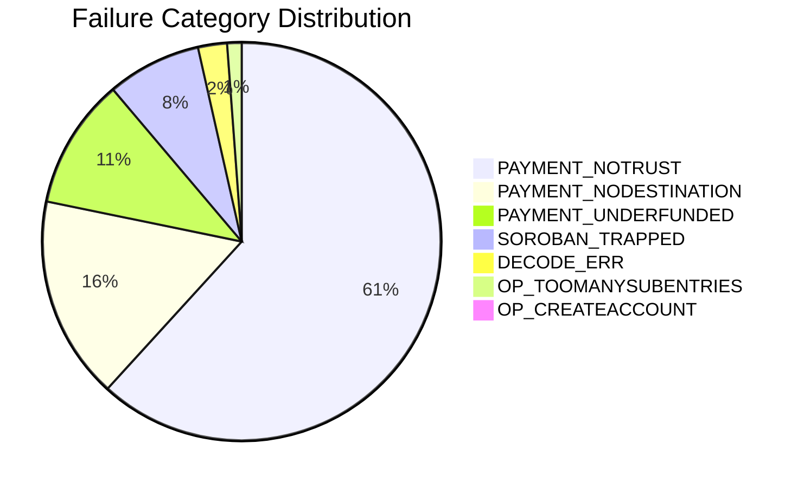

---

## 4. Comparative Group Analysis

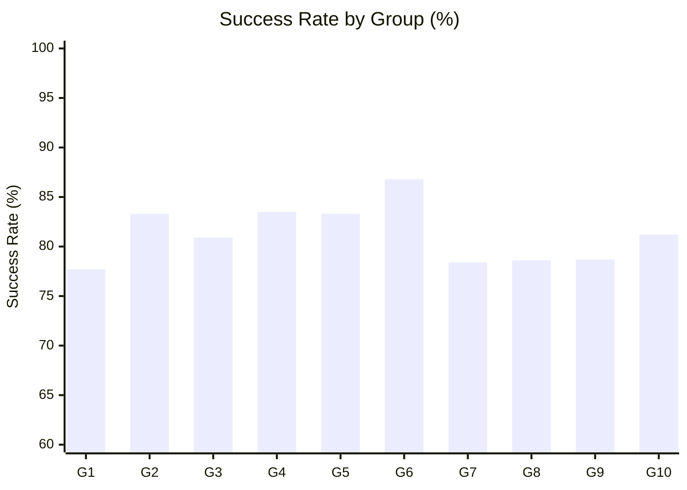

| Group | Ledgers | Total OK | Total FAIL | Success Rate | Fee Δ (XLM) |
|-------|---------|----------|------------|--------------|-------------|
| 1 | L#3647282-L#3647291 | 80 | 23 | 77.7% | +2.706 |
| 2 | L#3647292-L#3647301 | 65 | 13 | 83.3% | +1.812 |
| 3 | L#3647302-L#3647311 | 72 | 17 | 80.9% | +0.130 |
| 4 | L#3647312-L#3647321 | 76 | 15 | 83.5% | +0.144 |
| 5 | L#3647322-L#3647331 | 75 | 15 | 83.3% | +0.100 |
| 6 | L#3647332-L#3647341 | 92 | 14 | 86.8% | +0.190 |
| 7 | L#3647342-L#3647351 | 76 | 21 | 78.4% | +0.284 |
| 8 | L#3647352-L#3647361 | 77 | 21 | 78.6% | +0.162 |
| 9 | L#3647362-L#3647371 | 74 | 20 | 78.7% | +0.673 |
| 10 | L#3647372-L#3647381 | 82 | 19 | 81.2% | +0.000 |

---

## 5. General Analysis

### 5.1 Observed Performance

The 100-ledger monitoring on Stellar Testnet Horizon revealed an **overall success rate of 81.7%**, with 765 successful operations and 171 failures. The total of 960 transactions processed 1,440 operations, resulting in an average of 1.5 operations per transaction.

### 5.2 Failure Patterns

The predominant failure category was **PAYMENT_NOTRUST** (61%), indicating that most failed transactions involved accounts without an established trustline for the asset used. The **PAYMENT_NODESTINATION** (16%) and **PAYMENT_UNDERFUNDED** (11%) categories also contributed significantly, suggesting wallet configuration problems and insufficient balance, respectively.

### 5.3 Variability Between Groups

The success rate ranged between **77.7% (Group 1)** and **86.8% (Group 6)**, demonstrating moderate fluctuation in network behavior. Group 6 showed the best performance, while Groups 7, 8, and 9 maintained stable rates around 78-79%.

### 5.4 Fee Pool

The total fee accumulation was **+6.2009 XLM** over the 100 ledgers. The highest concentration of fees occurred in Group 1 (+2.706 XLM), while Group 10 accumulated no new fees in the final monitored period.

### 5.5 Recommendations

1. **Investigate accounts with PAYMENT_NOTRUST:** Prioritize the creation of adequate trustlines for assets used in the tests.
2. **Check test balances:** Ensure that test accounts have sufficient balance before starting operations.
3. **Continuous monitoring:** Keep watch over the success rate to identify premature service degradation.
4. **SOROBAN_TRAPPED analysis:** Investigate the 13 occurrences of traps in smart contracts to optimize code.

---

**Report generated on:** July 16, 2026  
**Monitoring Tool:** Stellar Testnet Horizon Docker  
**Contact:** Master's Degree Program
