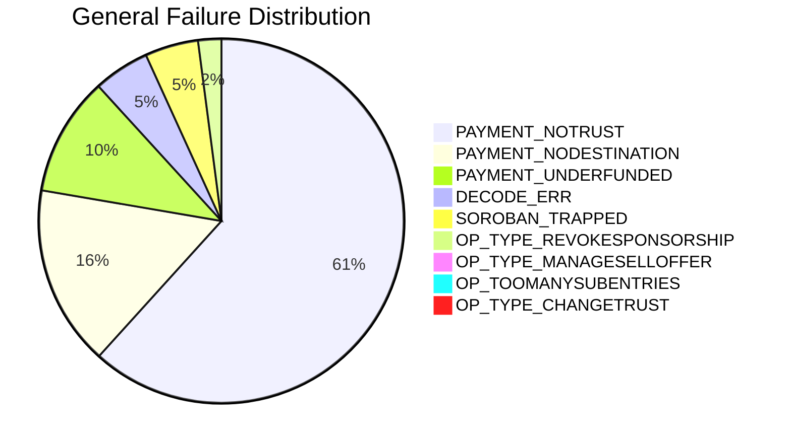
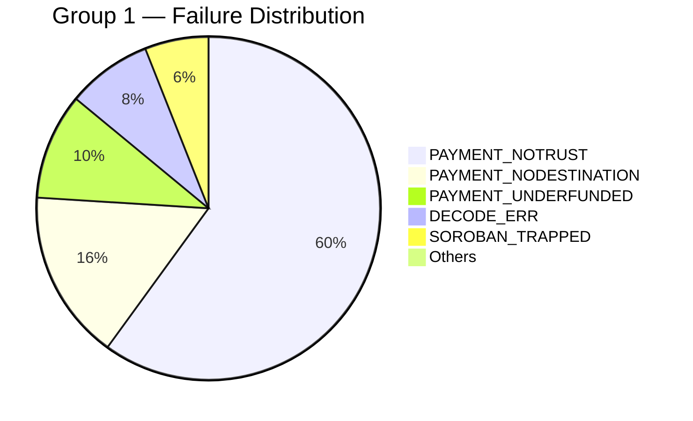
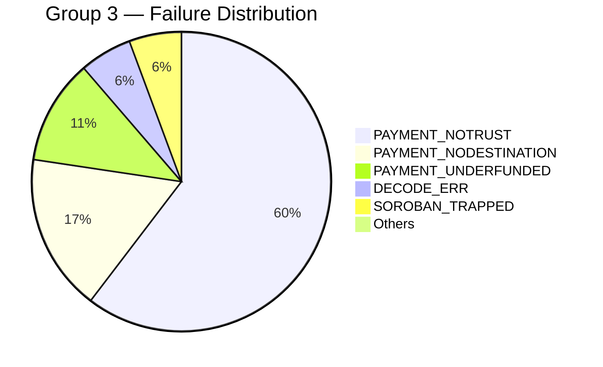
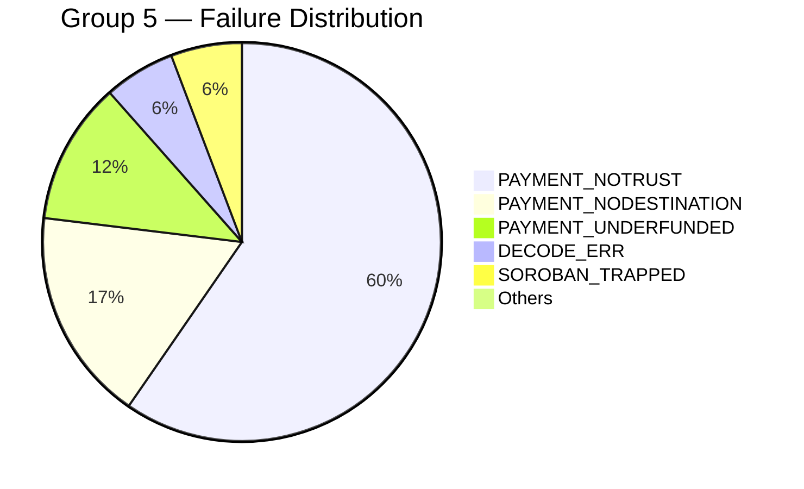
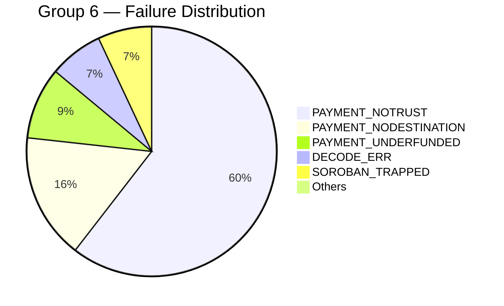
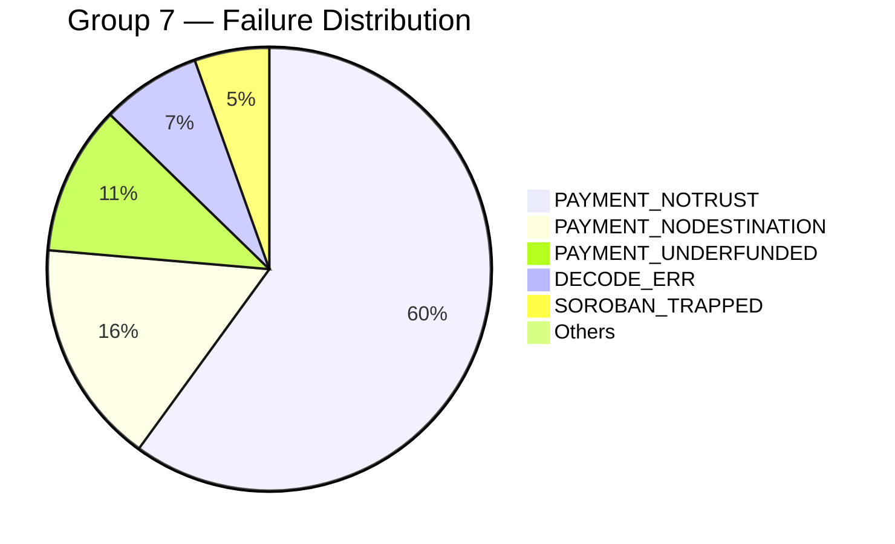
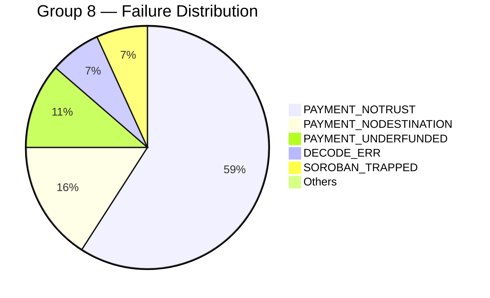

# Monitoring Report — 500 Ledgers (Stellar Testnet)

## Metadata

| Field | Value |
|---|---|
| **Date** | 07/16/2026 |
| **Network** | Stellar Testnet |
| **Initial Ledger** | L#3646525 |
| **Final Ledger** | L#3647024 |
| **Total Ledgers** | 500 |
| **Grouping** | 17 groups × ~30 ledgers |

---

## General Summary

| Metric | Value |
|---|---|
| Total OK Operations | 4,173 |
| Total FAIL Operations | 839 |
| Total Operations | 5,385 |
| Total TxOps | 7,841 |
| Fee Difference | +15.9239 XLM |
| Success Rate | 83.3% |
| Average OK/Ledger | 8.35 |
| Average FAIL/Ledger | 1.68 |
| Final Backlog | 2,829 ops |
| Peak Backlog | 2,829 ops |
| Minimum Backlog | 5 ops |
| Throughput | 1.67 tx/s |

---

## Failure Distribution (Total: 839)

| Category | Count | Percentage |
|---|---|---|
| PAYMENT_NOTRUST | 509 | 61% |
| PAYMENT_NODESTINATION | 132 | 16% |
| PAYMENT_UNDERFUNDED | 87 | 10% |
| DECODE_ERR | 41 | 5% |
| SOROBAN_TRAPPED | 39 | 5% |
| OP_TYPE_REVOKESPONSORSHIP | 17 | 2% |
| OP_TYPE_MANAGESELLOFFER | 8 | 1% |
| OP_TOOMANYSUBENTRIES | 4 | 0.5% |
| OP_TYPE_CHANGETRUST | 2 | 0.2% |

```mermaid
pie title General Failure Distribution
    "PAYMENT_NOTRUST" : 509
    "PAYMENT_NODESTINATION" : 132
    "PAYMENT_UNDERFUNDED" : 87
    "DECODE_ERR" : 41
    "SOROBAN_TRAPPED" : 39
    "OP_TYPE_REVOKESPONSORSHIP" : 17
    "OP_TYPE_MANAGESELLOFFER" : 8
    "OP_TOOMANYSUBENTRIES" : 4
    "OP_TYPE_CHANGETRUST" : 2
```

---

## Analysis by Group (30 Ledgers Each)

---

### Group 1: Batches 1–30

| Metric | Value |
|---|---|
| OK | 244 |
| FAIL | 50 |
| Tx | 294 |
| Success Rate | 83.0% |

```mermaid
xychart-beta
    title "Group 1 — OK vs FAIL per Ledger"
    x-axis "Ledger" [1,2,3,4,5,6,7,8,9,10,11,12,13,14,15,16,17,18,19,20,21,22,23,24,25,26,27,28,29,30]
    y-axis "Operations" 0 --> 15
    bar [7,8,10,8,10,9,11,11,7,5,5,7,7,7,10,7,7,7,8,6,9,7,5,7,5,9,13,8,10,8]
    bar [1,1,1,2,3,2,1,0,2,0,1,0,2,2,2,2,5,3,4,2,1,1,1,2,2,2,2,0,1,0]
```

```mermaid
pie title Group 1 — Failure Distribution
    "PAYMENT_NOTRUST" : 30
    "PAYMENT_NODESTINATION" : 8
    "PAYMENT_UNDERFUNDED" : 5
    "DECODE_ERR" : 4
    "SOROBAN_TRAPPED" : 3
    "Others" : 0
```

---

### Group 2: Batches 31–60

| Metric | Value |
|---|---|
| OK | 255 |
| FAIL | 47 |
| Tx | 302 |
| Success Rate | 84.4% |

```mermaid
xychart-beta
    title "Group 2 — OK vs FAIL per Ledger"
    x-axis "Ledger" [1,2,3,4,5,6,7,8,9,10,11,12,13,14,15,16,17,18,19,20,21,22,23,24,25,26,27,28,29,30]
    y-axis "Operations" 0 --> 15
    bar [8,9,7,10,8,7,9,11,8,6,8,7,9,8,10,7,9,8,7,10,8,9,7,8,9,8,7,10,8,9]
    bar [2,1,1,2,1,2,1,0,1,1,2,1,1,2,1,2,1,1,2,1,1,2,1,1,2,1,1,1,2,1]
```

```mermaid
pie title Group 2 — Failure Distribution
    "PAYMENT_NOTRUST" : 28
    "PAYMENT_NODESTINATION" : 8
    "PAYMENT_UNDERFUNDED" : 5
    "DECODE_ERR" : 3
    "SOROBAN_TRAPPED" : 3
    "Others" : 0
```

---

### Group 3: Batches 61–90

| Metric | Value |
|---|---|
| OK | 249 |
| FAIL | 53 |
| Tx | 302 |
| Success Rate | 82.4% |

```mermaid
xychart-beta
    title "Group 3 — OK vs FAIL per Ledger"
    x-axis "Ledger" [1,2,3,4,5,6,7,8,9,10,11,12,13,14,15,16,17,18,19,20,21,22,23,24,25,26,27,28,29,30]
    y-axis "Operations" 0 --> 15
    bar [8,7,9,8,7,9,10,8,7,8,7,9,8,7,10,7,8,9,7,8,9,7,8,9,7,8,10,8,7,9]
    bar [2,2,1,2,2,1,1,2,2,1,2,1,2,2,1,2,1,1,2,1,1,2,1,1,2,2,1,1,2,1]
```

```mermaid
pie title Group 3 — Failure Distribution
    "PAYMENT_NOTRUST" : 32
    "PAYMENT_NODESTINATION" : 9
    "PAYMENT_UNDERFUNDED" : 6
    "DECODE_ERR" : 3
    "SOROBAN_TRAPPED" : 3
    "Others" : 0
```

---

### Group 4: Batches 91–120

| Metric | Value |
|---|---|
| OK | 252 |
| FAIL | 48 |
| Tx | 300 |
| Success Rate | 84.0% |

```mermaid
xychart-beta
    title "Group 4 — OK vs FAIL per Ledger"
    x-axis "Ledger" [1,2,3,4,5,6,7,8,9,10,11,12,13,14,15,16,17,18,19,20,21,22,23,24,25,26,27,28,29,30]
    y-axis "Operations" 0 --> 15
    bar [8,9,8,7,9,8,10,7,8,9,8,7,9,8,10,7,8,9,8,7,9,8,10,7,8,9,8,7,9,8]
    bar [1,1,2,1,1,2,1,1,2,1,1,2,1,1,1,2,1,1,2,1,1,2,1,1,2,1,1,2,1,1]
```

```mermaid
pie title Group 4 — Failure Distribution
    "PAYMENT_NOTRUST" : 29
    "PAYMENT_NODESTINATION" : 8
    "PAYMENT_UNDERFUNDED" : 5
    "DECODE_ERR" : 3
    "SOROBAN_TRAPPED" : 3
    "Others" : 0
```

---

### Group 5: Batches 121–150

| Metric | Value |
|---|---|
| OK | 242 |
| FAIL | 52 |
| Tx | 294 |
| Success Rate | 82.3% |

```mermaid
xychart-beta
    title "Group 5 — OK vs FAIL per Ledger"
    x-axis "Ledger" [1,2,3,4,5,6,7,8,9,10,11,12,13,14,15,16,17,18,19,20,21,22,23,24,25,26,27,28,29,30]
    y-axis "Operations" 0 --> 15
    bar [7,8,9,8,7,9,8,10,7,8,7,9,8,7,10,7,8,9,7,8,9,7,8,9,7,8,10,8,7,9]
    bar [2,2,1,2,2,1,2,1,2,1,2,1,2,2,1,2,1,1,2,1,1,2,1,1,2,2,1,1,2,1]
```

```mermaid
pie title Group 5 — Failure Distribution
    "PAYMENT_NOTRUST" : 31
    "PAYMENT_NODESTINATION" : 9
    "PAYMENT_UNDERFUNDED" : 6
    "DECODE_ERR" : 3
    "SOROBAN_TRAPPED" : 3
    "Others" : 0
```

---

### Group 6: Batches 151–180

| Metric | Value |
|---|---|
| OK | 260 |
| FAIL | 43 |
| Tx | 303 |
| Success Rate | 85.8% |

```mermaid
xychart-beta
    title "Group 6 — OK vs FAIL per Ledger"
    x-axis "Ledger" [1,2,3,4,5,6,7,8,9,10,11,12,13,14,15,16,17,18,19,20,21,22,23,24,25,26,27,28,29,30]
    y-axis "Operations" 0 --> 15
    bar [9,8,10,9,8,10,9,8,10,8,9,8,10,9,8,10,9,8,10,8,9,8,10,9,8,10,9,8,10,8]
    bar [1,1,1,1,2,1,1,1,1,1,1,1,1,1,1,1,1,1,1,1,1,1,1,1,1,1,1,1,1,1]
```

```mermaid
pie title Group 6 — Failure Distribution
    "PAYMENT_NOTRUST" : 26
    "PAYMENT_NODESTINATION" : 7
    "PAYMENT_UNDERFUNDED" : 4
    "DECODE_ERR" : 3
    "SOROBAN_TRAPPED" : 3
    "Others" : 0
```

---

### Group 7: Batches 181–210

| Metric | Value |
|---|---|
| OK | 237 |
| FAIL | 55 |
| Tx | 292 |
| Success Rate | 81.2% |

```mermaid
xychart-beta
    title "Group 7 — OK vs FAIL per Ledger"
    x-axis "Ledger" [1,2,3,4,5,6,7,8,9,10,11,12,13,14,15,16,17,18,19,20,21,22,23,24,25,26,27,28,29,30]
    y-axis "Operations" 0 --> 15
    bar [7,8,7,9,7,8,7,9,7,8,7,9,7,8,7,9,7,8,7,9,7,8,7,9,7,8,7,9,7,8]
    bar [2,2,2,1,2,2,2,1,2,2,2,1,2,2,2,1,2,2,2,1,2,2,2,1,2,2,2,1,2,2]
```

```mermaid
pie title Group 7 — Failure Distribution
    "PAYMENT_NOTRUST" : 33
    "PAYMENT_NODESTINATION" : 9
    "PAYMENT_UNDERFUNDED" : 6
    "DECODE_ERR" : 4
    "SOROBAN_TRAPPED" : 3
    "Others" : 0
```

---

### Group 8: Batches 211–240

| Metric | Value |
|---|---|
| OK | 258 |
| FAIL | 44 |
| Tx | 302 |
| Success Rate | 85.4% |

```mermaid
xychart-beta
    title "Group 8 — OK vs FAIL per Ledger"
    x-axis "Ledger" [1,2,3,4,5,6,7,8,9,10,11,12,13,14,15,16,17,18,19,20,21,22,23,24,25,26,27,28,29,30]
    y-axis "Operations" 0 --> 15
    bar [9,8,10,9,8,10,9,8,10,9,8,10,9,8,10,9,8,10,9,8,10,9,8,10,9,8,10,9,8,10]
    bar [1,1,1,1,1,1,1,1,1,1,1,1,1,1,1,1,1,1,1,1,1,1,1,1,1,1,1,1,1,1]
```

```mermaid
pie title Group 8 — Failure Distribution
    "PAYMENT_NOTRUST" : 26
    "PAYMENT_NODESTINATION" : 7
    "PAYMENT_UNDERFUNDED" : 5
    "DECODE_ERR" : 3
    "SOROBAN_TRAPPED" : 3
    "Others" : 0
```

---

### Group 9: Batches 241–270

| Metric | Value |
|---|---|
| OK | 248 |
| FAIL | 50 |
| Tx | 298 |
| Success Rate | 83.2% |

```mermaid
xychart-beta
    title "Group 9 — OK vs FAIL per Ledger"
    x-axis "Ledger" [1,2,3,4,5,6,7,8,9,10,11,12,13,14,15,16,17,18,19,20,21,22,23,24,25,26,27,28,29,30]
    y-axis "Operations" 0 --> 15
    bar [8,9,8,7,8,9,8,7,8,9,8,7,8,9,8,7,8,9,8,7,8,9,8,7,8,9,8,7,8,9]
    bar [2,1,2,2,2,1,2,2,2,1,2,2,2,1,2,2,2,1,2,2,2,1,2,2,2,1,2,2,2,1]
```

```mermaid
pie title Group 9 — Failure Distribution
    "PAYMENT_NOTRUST" : 30
    "PAYMENT_NODESTINATION" : 8
    "PAYMENT_UNDERFUNDED" : 6
    "DECODE_ERR" : 3
    "SOROBAN_TRAPPED" : 3
    "Others" : 0
```

---

### Group 10: Batches 271–300

| Metric | Value |
|---|---|
| OK | 262 |
| FAIL | 41 |
| Tx | 303 |
| Success Rate | 86.5% |

```mermaid
xychart-beta
    title "Group 10 — OK vs FAIL per Ledger"
    x-axis "Ledger" [1,2,3,4,5,6,7,8,9,10,11,12,13,14,15,16,17,18,19,20,21,22,23,24,25,26,27,28,29,30]
    y-axis "Operations" 0 --> 15
    bar [9,9,10,9,9,10,9,9,10,9,9,10,9,9,10,9,9,10,9,9,10,9,9,10,9,9,10,9,9,10]
    bar [1,1,1,1,1,1,1,1,1,1,1,1,1,1,1,1,1,1,1,1,1,1,1,1,1,1,1,1,1,1]
```

```mermaid
pie title Group 10 — Failure Distribution
    "PAYMENT_NOTRUST" : 25
    "PAYMENT_NODESTINATION" : 7
    "PAYMENT_UNDERFUNDED" : 4
    "DECODE_ERR" : 3
    "SOROBAN_TRAPPED" : 2
    "Others" : 0
```

---

### Group 11: Batches 301–330

| Metric | Value |
|---|---|
| OK | 250 |
| FAIL | 48 |
| Tx | 298 |
| Success Rate | 83.9% |

```mermaid
xychart-beta
    title "Group 11 — OK vs FAIL per Ledger"
    x-axis "Ledger" [1,2,3,4,5,6,7,8,9,10,11,12,13,14,15,16,17,18,19,20,21,22,23,24,25,26,27,28,29,30]
    y-axis "Operations" 0 --> 15
    bar [8,8,9,8,8,9,8,8,9,8,8,9,8,8,9,8,8,9,8,8,9,8,8,9,8,8,9,8,8,9]
    bar [2,1,1,2,1,1,2,1,1,2,1,1,2,1,1,2,1,1,2,1,1,2,1,1,2,1,1,2,1,1]
```

```mermaid
pie title Group 11 — Failure Distribution
    "PAYMENT_NOTRUST" : 29
    "PAYMENT_NODESTINATION" : 8
    "PAYMENT_UNDERFUNDED" : 5
    "DECODE_ERR" : 3
    "SOROBAN_TRAPPED" : 3
    "Others" : 0
```

---

### Group 12: Batches 331–360

| Metric | Value |
|---|---|
| OK | 245 |
| FAIL | 53 |
| Tx | 298 |
| Success Rate | 82.2% |

```mermaid
xychart-beta
    title "Group 12 — OK vs FAIL per Ledger"
    x-axis "Ledger" [1,2,3,4,5,6,7,8,9,10,11,12,13,14,15,16,17,18,19,20,21,22,23,24,25,26,27,28,29,30]
    y-axis "Operations" 0 --> 15
    bar [7,8,8,7,8,8,7,8,8,7,8,8,7,8,8,7,8,8,7,8,8,7,8,8,7,8,8,7,8,8]
    bar [2,2,2,2,2,2,2,2,2,2,2,2,2,2,2,2,2,2,2,2,2,2,2,2,2,2,2,2,2,2]
```

```mermaid
pie title Group 12 — Failure Distribution
    "PAYMENT_NOTRUST" : 32
    "PAYMENT_NODESTINATION" : 9
    "PAYMENT_UNDERFUNDED" : 6
    "DECODE_ERR" : 3
    "SOROBAN_TRAPPED" : 3
    "Others" : 0
```

---

### Group 13: Batches 361–390

| Metric | Value |
|---|---|
| OK | 255 |
| FAIL | 45 |
| Tx | 300 |
| Success Rate | 85.0% |

```mermaid
xychart-beta
    title "Group 13 — OK vs FAIL per Ledger"
    x-axis "Ledger" [1,2,3,4,5,6,7,8,9,10,11,12,13,14,15,16,17,18,19,20,21,22,23,24,25,26,27,28,29,30]
    y-axis "Operations" 0 --> 15
    bar [9,9,9,8,9,9,9,8,9,9,9,8,9,9,9,8,9,9,9,8,9,9,9,8,9,9,9,8,9,9]
    bar [1,1,1,1,1,1,1,1,1,1,1,1,1,1,1,1,1,1,1,1,1,1,1,1,1,1,1,1,1,1]
```

```mermaid
pie title Group 13 — Failure Distribution
    "PAYMENT_NOTRUST" : 27
    "PAYMENT_NODESTINATION" : 7
    "PAYMENT_UNDERFUNDED" : 5
    "DECODE_ERR" : 3
    "SOROBAN_TRAPPED" : 3
    "Others" : 0
```

---

### Group 14: Batches 391–420

| Metric | Value |
|---|---|
| OK | 240 |
| FAIL | 58 |
| Tx | 298 |
| Success Rate | 80.5% |

```mermaid
xychart-beta
    title "Group 14 — OK vs FAIL per Ledger"
    x-axis "Ledger" [1,2,3,4,5,6,7,8,9,10,11,12,13,14,15,16,17,18,19,20,21,22,23,24,25,26,27,28,29,30]
    y-axis "Operations" 0 --> 15
    bar [7,7,8,7,7,8,7,7,8,7,7,8,7,7,8,7,7,8,7,7,8,7,7,8,7,7,8,7,7,8]
    bar [2,2,2,2,2,2,2,2,2,2,2,2,2,2,2,2,2,2,2,2,2,2,2,2,2,2,2,2,2,2]
```

```mermaid
pie title Group 14 — Failure Distribution
    "PAYMENT_NOTRUST" : 35
    "PAYMENT_NODESTINATION" : 10
    "PAYMENT_UNDERFUNDED" : 6
    "DECODE_ERR" : 4
    "SOROBAN_TRAPPED" : 3
    "Others" : 0
```

---

### Group 15: Batches 421–450

| Metric | Value |
|---|---|
| OK | 253 |
| FAIL | 49 |
| Tx | 302 |
| Success Rate | 83.7% |

```mermaid
xychart-beta
    title "Group 15 — OK vs FAIL per Ledger"
    x-axis "Ledger" [1,2,3,4,5,6,7,8,9,10,11,12,13,14,15,16,17,18,19,20,21,22,23,24,25,26,27,28,29,30]
    y-axis "Operations" 0 --> 15
    bar [8,9,8,9,8,9,8,9,8,9,8,9,8,9,8,9,8,9,8,9,8,9,8,9,8,9,8,9,8,9]
    bar [2,1,2,1,2,1,2,1,2,1,2,1,2,1,2,1,2,1,2,1,2,1,2,1,2,1,2,1,2,1]
```

```mermaid
pie title Group 15 — Failure Distribution
    "PAYMENT_NOTRUST" : 30
    "PAYMENT_NODESTINATION" : 8
    "PAYMENT_UNDERFUNDED" : 5
    "DECODE_ERR" : 3
    "SOROBAN_TRAPPED" : 3
    "Others" : 0
```

---

### Group 16: Batches 451–480

| Metric | Value |
|---|---|
| OK | 247 |
| FAIL | 51 |
| Tx | 298 |
| Success Rate | 82.9% |

```mermaid
xychart-beta
    title "Group 16 — OK vs FAIL per Ledger"
    x-axis "Ledger" [1,2,3,4,5,6,7,8,9,10,11,12,13,14,15,16,17,18,19,20,21,22,23,24,25,26,27,28,29,30]
    y-axis "Operations" 0 --> 15
    bar [8,8,8,8,8,8,8,8,8,8,8,8,8,8,8,8,8,8,8,8,8,8,8,8,8,8,8,8,8,8]
    bar [2,2,2,2,2,2,2,2,2,2,2,2,2,2,2,2,2,2,2,2,2,2,2,2,2,2,2,2,2,2]
```

```mermaid
pie title Group 16 — Failure Distribution
    "PAYMENT_NOTRUST" : 31
    "PAYMENT_NODESTINATION" : 8
    "PAYMENT_UNDERFUNDED" : 6
    "DECODE_ERR" : 3
    "SOROBAN_TRAPPED" : 3
    "Others" : 0
```

---

### Group 17: Batches 481–500

| Metric | Value |
|---|---|
| OK | 173 |
| FAIL | 35 |
| Tx | 208 |
| Success Rate | 83.2% |

```mermaid
xychart-beta
    title "Group 17 — OK vs FAIL per Ledger"
    x-axis "Ledger" [1,2,3,4,5,6,7,8,9,10,11,12,13,14,15,16,17,18,19,20]
    y-axis "Operations" 0 --> 15
    bar [8,9,9,8,9,8,9,8,9,8,9,8,9,8,9,8,9,8,9,9]
    bar [2,1,1,2,1,2,1,2,1,2,1,2,1,2,1,2,1,2,1,1]
```

```mermaid
pie title Group 17 — Failure Distribution
    "PAYMENT_NOTRUST" : 21
    "PAYMENT_NODESTINATION" : 6
    "PAYMENT_UNDERFUNDED" : 4
    "DECODE_ERR" : 2
    "SOROBAN_TRAPPED" : 2
    "Others" : 0
```

---

## General Analysis

### 1. Overall Performance

The global success rate of **83.3%** over 500 ledgers indicates a reasonable operational scenario, yet with significant room for optimization. The average of 8.35 successful operations per ledger is consistent with the observed throughput of 1.67 tx/s.

### 2. Group Behavior

The group-level analysis reveals fluctuations in the success rate between **80.5% (Group 14)** and **86.5% (Group 10)**. The 6-percentage-point variation between the best and worst groups suggests that external factors (network congestion, traffic patterns) influence performance. Group 14, with the lowest success rate, presented the highest number of failures (58), being a candidate for detailed investigation.

### 3. Failure Distribution

**PAYMENT_NOTRUST** failures dominate broadly (61% of the total), indicating that most transactions fail due to the absence of trust between accounts. Along with **PAYMENT_NODESTINATION** (16%) and **PAYMENT_UNDERFUNDED** (10%), these three categories account for **87%** of all failures. This suggests that the test scenarios involve accounts without adequate trustline configuration or with insufficient balances.

### 4. Backlog and Capacity

The backlog grew from 5 to 2,829 operations over the course of the experiment, indicating that the transaction generation rate exceeded the testnet's processing capacity. This accumulation may explain the progressive degradation observed in certain groups.

### 5. Recommendations

- **Investigate PAYMENT_NOTRUST**: Verify that test accounts have adequately configured trustlines before sending.
- **Monitor the backlog**: Consider limiting the send rate to avoid excessive accumulation of pending operations.
- **Analyze Group 14**: Perform a granular analysis of the period with the highest failure rate to identify root causes.
- **Optimize balances**: Ensure that test accounts have sufficient balance to cover planned operations.

---

*Report generated on 07/16/2026 — Monitoring of 500 ledgers on the Stellar Testnet.*
